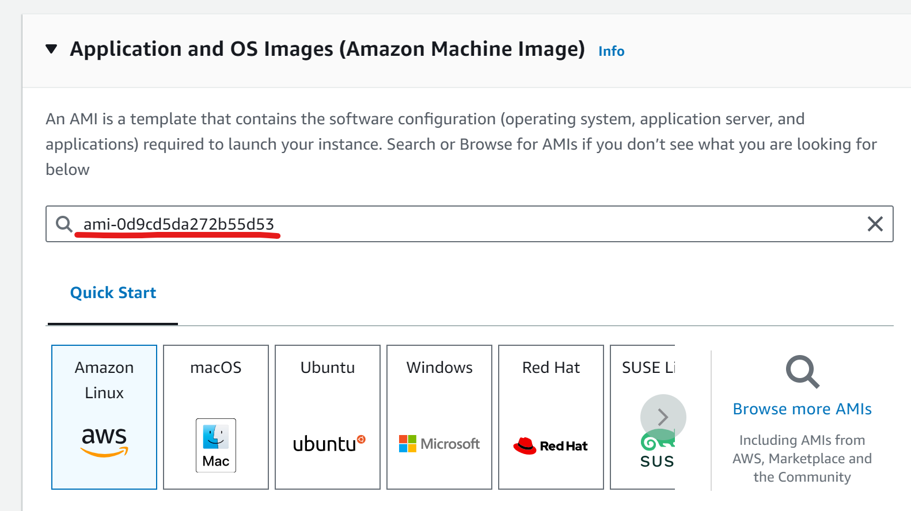

# Creating a Memory Forensics AWS EC2

## Prerequisite
1. Please ensure you have created an AWS account [here](https://aws.amazon.com/console/).
    1. when prompted for credit card details, you may choose to use a prepaid debit card (Revolut, YouTrip, etc)

## Steps
1. Login to AWS [console]((https://aws.amazon.com/console/)).
1. At the top right hand corner, ensure that your region is `Singapore`. If it is some other Region, click on it and change the region to `Asia Pacific (Singapore)`.
<br/>

1. At the top left hand corner, search for `EC2` and click on the first option.
<br/>

1. Click on `Launch instance`.
<br/>

1. Provide a name for the EC2 (e.g. `FSC5203-Memory-Forensics`). 
<br/>

1. Under `Application and OS Images (Amazon Machine Image)`, search for `ami-0d9cd5da272b55d53` and press the `enter` key.
<br/>

1. At the `Choose an Amazon Machine Image (AMI)` page, click `Community AMIs` and click `select`.
<br/>

1. Scroll down to `Key pair (login)` and select `Proceed without a key pair (Not recommended)`.
<br/>

1. On the right, click `Launch instance`.
<br/>

1. Wait for the instance to launch, and you should see a green success message after awhile. Click on the instance ID.
<br/>

1. Wait for a couple of minutes for the instance to be ready. The instance is ready when you see `Running` under the instance state. Click on the instance ID.
<br/>

1. Click on the `Connect` button at the right corner.
<br/>

1. Change the User name to `ec2-user` and click `Connect`.
<br/>


1. Copy and paste the following command into the terminal to download the memory dump into the EC2 instance.
    ```bash
    wget "https://hometeamsnt-my.sharepoint.com/:u:/g/personal/kangli_li_hometeamsnt_onmicrosoft_com/ETteCRKWcsNLhdzdagxVuIgBp698d-tmG5Dj7LibmnTStQ?e=eb0Itb&download=1" -O memory.dmp
    ```
    <br/>
    

1. You may proceed to run volaility3 commands on `memory.dmp` after the download is complete. One example command as shown below:
    ```bash
    python volatility3/vol.py -f memory.dmp windows.pslist
    ```
    <br/>
    

1. Once you are done, you may close the tab. (Do note that closing the tab does not shut down the EC2 instance.)
1. To shutdown the instance, navigate back to the instance page by clicking on the instance ID at the `Connect to instance` page. You may also search `EC2` and click `Instances (running)` followed by the instance ID to reach the instance page.
<br/>

1. On the right, click on `Instance state`
<br/>

1. If you are done with the examination and would like to delete the EC2, choose `Terminate instance` to stop and **DELETE** the EC2. If you would like to continue at a later time or day, choose `Stop instance` to shut down the EC2 instance without deleting it. To start the instance, select `Start instance`.